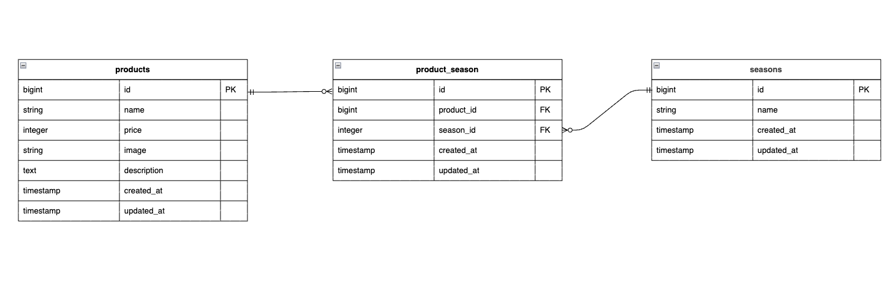

# もぎたて

##　環境構築

Dockerビルド

1. git clone git@github.com:miho-102/confirm-test-mogitate.git
2. DockerDesktopアプリを立ち上げる
3. docker-compose up -d --build

MacのM1・M2チップのPCの場合、no matching manifest for linux/arm64/v8 in the manifest list entriesのメッセージが表示されビルドができない場合があります。 エラーが発生する場合は、docker-compose.ymlファイルの「mysql」内に「platform」の項目を追加して記載してください

mysql:
platform: linux/x86_64(この文追加)
image: mysql:8.0.26
environment:

### Laravel環境構築

1. docker-compose exec php bash
2. composer install
3. 「.env.example」ファイルを 「.env」ファイルに命名を変更。または、.envファイルを作成します
4. .env以下の環境変数を追加

DB_CONNECTION=mysql
DB_HOST=mysql
DB_PORT=3306
DB_DATABASE=laravel_db
DB_USERNAME=laravel_user
DB_PASSWORD=laravel_pass

5.アプリケーションキーの作成
php artisan key:generate

6.マイグレーションの実行
php artisan migrate

7.シーディングの実行
php artisan db:seed

#### 利用技術(実行環境)

PHP 7.3 以上（PHP 8.x 対応）
Laravel 8.75以上
MySQL 8.0.26

##### URL

開発環境：http://localhost/
phpMyAdmin:：http://localhost:8080/

###### ER図

